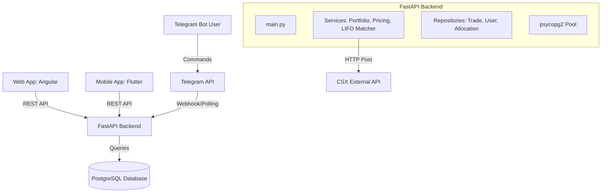
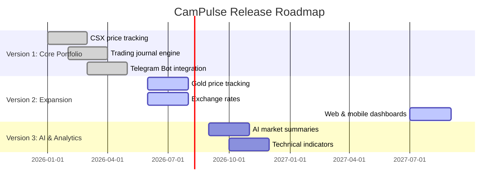

# Product Requirements Document (PRD): CamPulse

| Metadata | Details |
| :--- | :--- |
| **Project Name** | CamPulse |
| **Product Version** | 2.0.0 (Roadmap Progressing) |
| **Status** | Draft / Under Review |
| **Target Platforms** | Web App (Angular), Mobile App (Flutter), Telegram Bot |
| **Document Date** | July 7, 2026 |

---

## 1. Executive Summary & Vision

### 1.1 Objective
CamPulse is designed as Cambodia's premier financial ecosystem. The platform bridges the gap between raw market data and active retail investors by providing real-time Cambodia Securities Exchange (CSX) data, gold prices, currency exchange rates, and a high-performance portfolio tracking engine.

### 1.2 Target Audience
*   **Retail Stock Investors**: Active and passive traders on the Cambodia Securities Exchange (CSX).
*   **Gold & Commodity Traders**: Local investors tracking daily gold price movements.
*   **General Consumers & Businesses**: Individuals looking for daily multi-currency exchange rates (USD/KHR, THB/KHR, etc.).
*   **Power/Telegram Users**: Traders who prefer executing fast journal entry inputs and receiving instant visual reports via chat interfaces.

---

## 2. Product Features & Functional Requirements

### 2.1 Cambodia Stock Market (CSX) Tracking
*   **Stock Price Updates**: Pull live (or fast-cached) prices from the CSX trading methods.
*   **Company Profiles**: Static and historical profiles for listed tickers (e.g., PWSA, GTI, PPAP, PPSP, PAS, ABC, PEPC, DBDE, MJQE, CGSM).
*   **Market Summary**: Top gainers, top losers, daily volumes, and indices (CSX Index).
*   **Pricing Fallbacks**: If the CSX API is unreachable, local static fallbacks must automatically populate to prevent UI and command failures.

### 2.2 Commodities & Exchange Rates
*   **Gold Price Tracker**: Current local gold buy/sell rates with daily and weekly historical movement.
*   **Exchange Rate Service**: Real-time multi-currency conversions against the Cambodian Riel (KHR), featuring:
    *   USD/KHR
    *   THB/KHR
    *   EUR/KHR
    *   CNY/KHR
*   **Smart Price Alerts**: Custom user notifications when a stock, gold price, or exchange rate meets set thresholds.

### 2.3 Portfolio Management Engine (Core Backend Logic)
*   **Trade Log Logging**: Record all BUY and SELL transactions containing fields: `tradeId`, `userId`, `seq`, `ticker`, `side`, `price`, `qty`, `commission`, and `orderDate`.
*   **Lowest Price First (LPF) Matching**:
    *   When selling shares, the engine must match them against the lowest purchase cost lots first to maximize immediate realized profit/loss.
    *   Remaining higher-priced shares must remain in the open portfolio holdings.
    *   All allocations must trace the exact BUY trade mapping.
*   **Commission Calculation**: Apply a flat commission rate of **0.47%** (0.0047) of total transaction value (`price * qty`) for both buys and sells.
*   **Performance Metrics**: Calculate overall Portfolio valuation, Realized P/L, and Unrealized P/L based on current market rates.

### 2.4 Interface Integrations

#### A. Telegram Bot Command System
The Telegram Bot operates as a fast-input journal interface. It supports the following commands:
*   `/buy$ABC <price> <qty>` - Logs a buy trade.
*   `/sell$ABC <price> <qty>` - Logs a sell trade.
*   `/price$ABC` or `/price ABC` - Generates a visual price card.
*   `/show_all` - Returns a market overview card for all listed stocks.
*   `/portfolio` - Shows the user's total portfolio holding card.
*   `/position <ticker>` - Shows specific holdings for a ticker.
*   `/stock <ticker>` - Detailed breakdown of buy lots, remaining shares, and realized profits.
*   `/top_orders` - Lists the top 5 most profitable trades.
*   `/top_tickers` - Lists the top 5 most profitable stock positions.

#### B. Visual Cards & Charts Generation
*   **Matplotlib Rendering**: Use a dark-themed, premium design language (defined in `app/utils/theme.py`) to generate visual PNG/JPG cards.
*   **Visual Deliverables**:
    *   *Price Cards*: Colored gradients showing stock price, daily movement, and trend arrows.
    *   *Stock Details*: Tabular chart breaking down open buy lots and sell history.
    *   *Rankings Charts*: Visual bar charts for top tickers and top orders.

---

## 3. Technology Stack & Architecture

### 3.1 Tech Stack
*   **Backend**: Python 3.12, FastAPI (high-performance web framework).
*   **Libraries**:
    *   `python-telegram-bot` (v21.6)
    *   `psycopg2-binary` (PostgreSQL client pool)
    *   `matplotlib` (visual card generation)
    *   `cachetools` (45-second pricing cache)
    *   `pydantic` (validation)
    *   `logfire` (OpenTelemetry instrumentation)
*   **Database**: PostgreSQL 16 (for relational transactional schema: `users`, `trades`, `allocations`).

---

## 4. Product Roadmap

### 4.1 Future Scope (Roadmap Details)
*   **Version 3 (AI Market Summaries)**: Introduce AI-driven daily summaries of stock movements, watchlists, and technical indicator integrations.
*   **Version 4 (News & Performance)**: Aggregate local financial news, implement historical portfolio performance charts, and dividend tracking.
*   **Version 5 (Cross-Asset Expansion)**: Support US stocks, Cryptocurrencies, commodities, and a personalized AI investment assistant.
